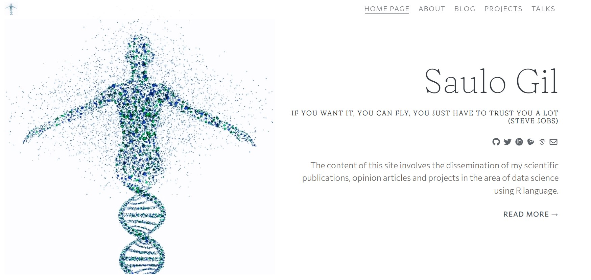

<!-- README.md is generated from README.Rmd. Please edit that file -->

```{r, include = FALSE}
knitr::opts_chunk$set(
  collapse = TRUE,
  comment = "#>"
)
```

# Blog

<!-- badges: start -->
<!-- badges: end -->

The repository refers to everything posted in my personal webpage.

I hope you enjoy!!!


```{r echo=FALSE}

```
[Click to access](https://saulogil.netlify.app/)`r emojifont::emoji("stuck_out_tongue_winking_eye")`!
