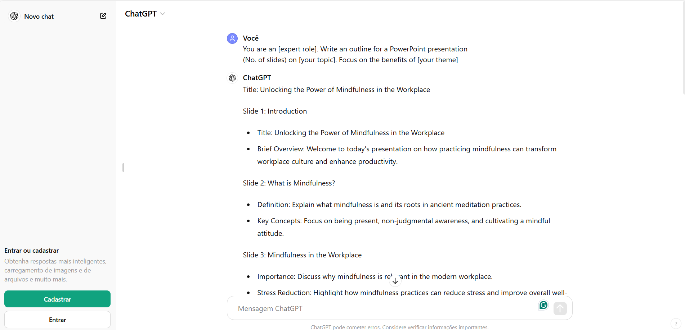
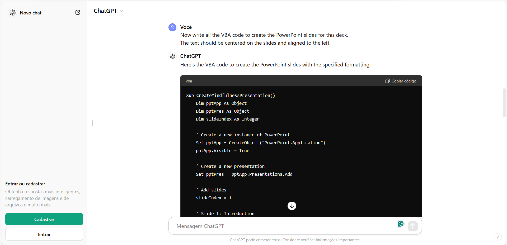
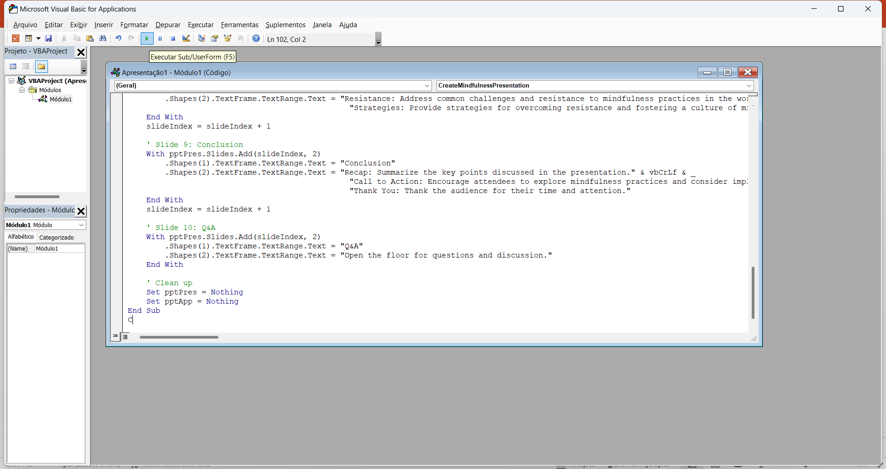
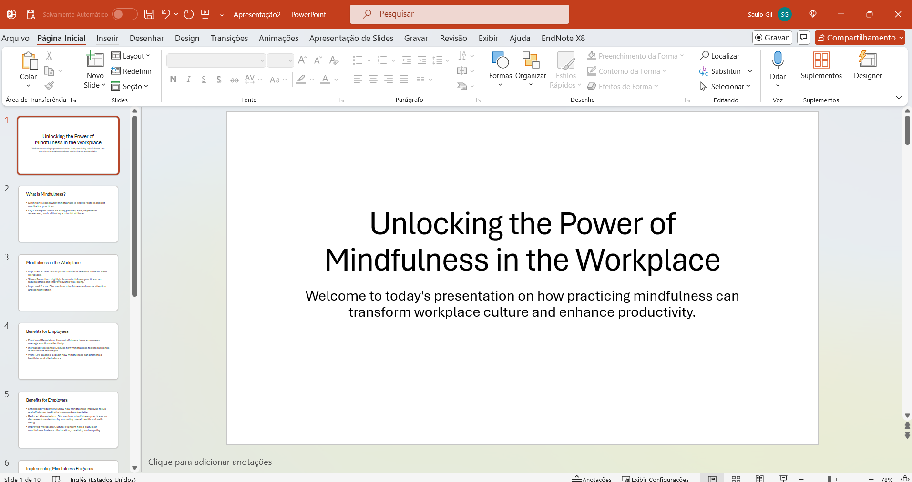
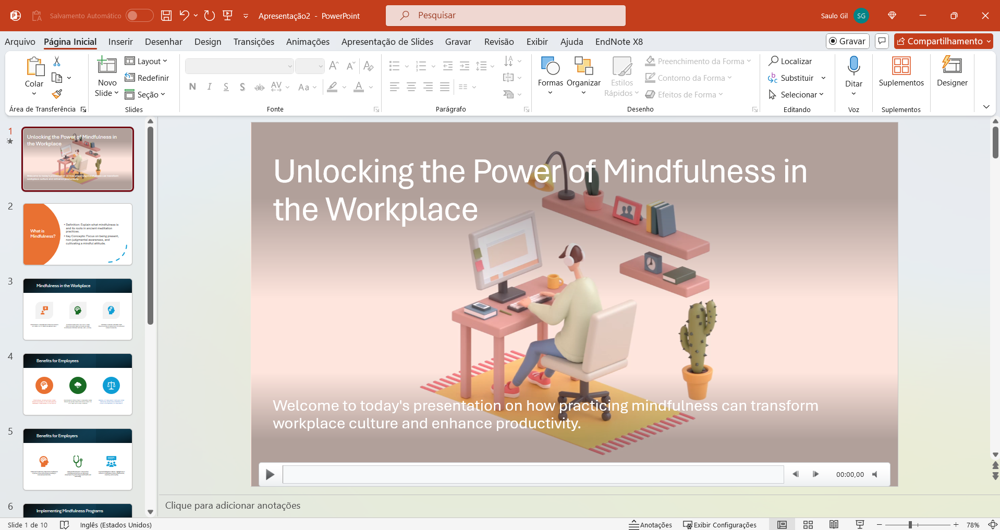

<!-- badges: start -->
<!-- badges: end -->

PowerPoint presentations have become ubiquitous in modern business and academic settings. However, all too often, we find ourselves subjected to boring slides that fail to captivate or communicate effectively.

Moreover, this task takes a long time⌚and, for many people, it is a boring task.

But, now, leveraging a Language Model like ChatGPT to create PowerPoint slides can be a game-changer in terms of efficiency and creativity.

🧐Here's how:

## Step 1 - Create a script:

1. Open http://chat.openai.com  on browser;

2. Start a new chat & type in the below prompt:

**Prompt**: You are an [expert role]. Write an outline for a PowerPoint presentation (No. of slides) on [your topic]. Focus on the benefits of [your theme]

 You can check complete script generated [here](pdf_files/script.pdf).

## Step 2 - Generate VBA code for PowerPoint:

Enter the prompt to generate the PowerPoint "code".

**Prompt**: Now write all the VBA code to create the PowerPoint slides for this deck. The text should be centered on the slides and aligned to the left.

For complete code generated, click [here](pdf_files/vba_code.pdf).

## Step 3 - Create slides in PowerPoint:

To create the PowerPoint slides:

1. Press Alt + F11 on Windows;

2. or Option + F11 on Mac;

Click "Insert" and select "Module"

Paste the code, and click the Play button

Let's see the slides!

## Step 4 - Customize:

It looks boring, don't worry!

Recent versions of Microsoft PowerPoint provide a feature called *Designer* that suggests automatic customization🤖for the slides. This feature customizes your slides in a few clicks.

Let's see it.

1. Click on the "Designer" option.

2. Choose a layout that suits your needs.

😍😍😍**AMAZING!!!**😍😍😍

## Finally✔️

As noted, the use of generative AI can assist in creating slides that can be used in any presentation.

This AI-powered feature drastically reduces the time spent preparing slides from scripting to formatting slides, enabling faster and more efficient production of high-quality presentations.

Despite the efficiency of this resource, it is important to highlight that the content must be carefully reviewed by the person responsible for creating it, as highly technical and specialized content may not be adequately developed by AI.

### References 
-[ChatGPT](https://chatgpt.com/);

-[Microsoft PowerPoint](https://www.microsoft.com/en-us/microsoft-365/powerpoint?ocid=ORSEARCH_Bing);

-[Madni Aghadi - PowerPoint is not enough: ChatGPT can make your slides better](https://x.com/hey_madni/status/1714992349061984542);

