# Commonly Plots with Seaborn (Python)

<!-- badges: start -->
<!-- badges: end -->

Data visualization is the graphical representation of data and information. It involves the creation of visual elements such as charts, graphs, maps, and dashboards to communicate complex data sets in a more understandable and insightful manner. Data visualization enables users to analyze, interpret, and understand patterns, trends, and relationships within data more effectively than they could through raw numbers or text alone.


The primary goals of data visualization include:

1. Clarity: Presenting data in a clear and understandable format, making complex information more accessible.

2. Insight: Facilitating the discovery of patterns, trends, and relationships within the data that might not be immediately apparent.

3. Communication: Enhancing communication of insights and findings to stakeholders, decision-makers, and the general audience.

4. Decision-making: Empowering informed decision-making based on data-driven insights.

Data visualization can be achieved using various tools and techniques, ranging from simple charts created in spreadsheet software to sophisticated interactive visualizations developed using specialized software and programming languages like R, JavaScript (with libraries like D3.js), and Python (with libraries like Matplotlib, Seaborn, Plotly).

Seaborn is a Python data visualization library based on Matplotlib. It provides a high-level interface for creating attractive statistical graphics. Seaborn is built on top of Matplotlib and integrates closely with Pandas data structures, making it particularly useful for visualizing datasets stored in Pandas DataFrames.

In this post, I show 10 commonly plots using Seaborn library from Python.

1. Bar Plots

2. Count Plots

3. Histograms

4. Cat Plots (Box, Violin, Swarm, Boxen)

5. Multiple Plots using FacetGrid

6. Joint Plots

7. KDE Plots

8. Pairplots

9. Heatmaps

10. Scatter Plots.

## SO, LET'S TO DO IT

## Libraries required
```{r load packages, echo=TRUE, message=FALSE, warning=FALSE}
library(reticulate) # R package to run Python scripts
```

```{Python echo=TRUE}
# Python libraries
import pandas as pd
import numpy as np
import seaborn as sns
import matplotlib
import matplotlib.pyplot as plt

%matplotlib inline
```

## Import dataset
```{Python echo=TRUE}
exercise = sns.load_dataset('exercise')
iris = sns.load_dataset('iris')
penguins = sns.load_dataset('penguins')
mpg = sns.load_dataset('mpg')
titanic = sns.load_dataset('titanic')
tips = sns.load_dataset('tips')
```

# 1. Bar Plots

Bar plots offer a means to visually represent diverse data sets, including counts, frequencies, percentages, or averages.

They prove especially valuable for illustrating and contrasting data across various categories.

We used titanic dataset to some bar plots

### *Categorical comparison*

```{Python echo=TRUE}
# Simple bar plot
sns.barplot(data=titanic, x='who', y='age', estimator='mean', errorbar=None, palette='viridis')
plt.title('Simple Barplot')
plt.xlabel('Person')
plt.ylabel('Average')
plt.show()
```

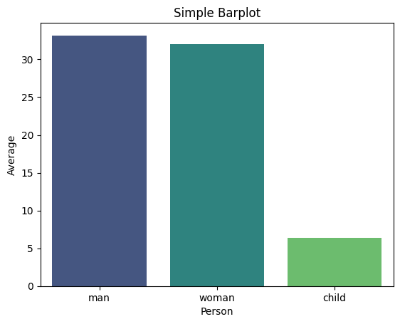

### *Proportional Representation through Stacked Bar Charts*

```{Python echo=TRUE}
# prepare dataset - groupby
data = titanic.groupby('embark_town').agg({'who':'count','sex': lambda x: (x=='male').sum()}).reset_index()
data.rename(columns={'who':'total', 'sex':'male'}, inplace=True)
data.sort_values('total', inplace=True))

# Barplot Showing Part of Total
sns.set_color_codes("pastel")
sns.barplot(x="total", y="embark_town", data=data,
            label="Female", color="b")  
sns.set_color_codes("muted")
sns.barplot(x="male", y="embark_town", data=data,
            label="Male", color="b")  
plt.title('Barplot Showing Part of Total')
plt.xlabel('Number of Persons')
plt.legend(loc='upper right')
plt.show()
```

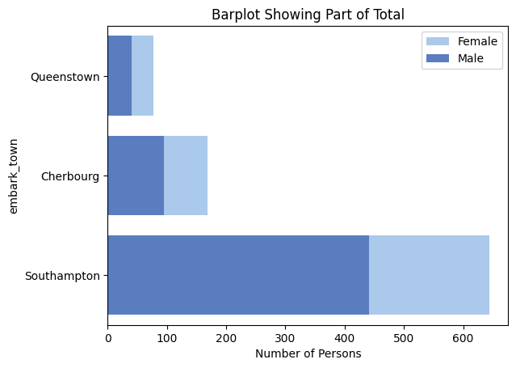

### *Comparison of Subcategories within each category through Clustered Bar Plots*
```{Python echo=TRUE}
# Clustered barplot
sns.barplot(data=titanic, x='class', y='age', hue='sex', estimator='mean', errorbar=None, palette='viridis')
plt.title('Clustered Barplot')
plt.xlabel('Class')
plt.ylabel('Average Age')
plt.show()
```

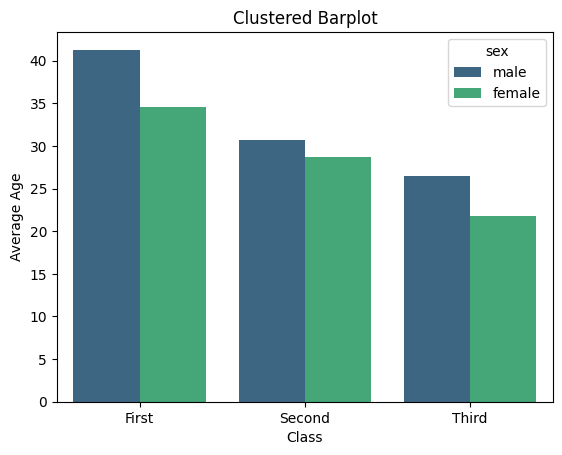
# 2. Count Plots
A count plot exhibits the occurrences of each category within a categorical variable.

On the x-axis lie the variable's categories, while the y-axis displays the count or frequency of each category.

### *Frequency Distribution of categorical variables*

```{Python echo=TRUE}
# Simple Countplot
sns.countplot(data=titanic, x='alive', palette='viridis')
plt.title('Simple Countplot')
plt.show()
```

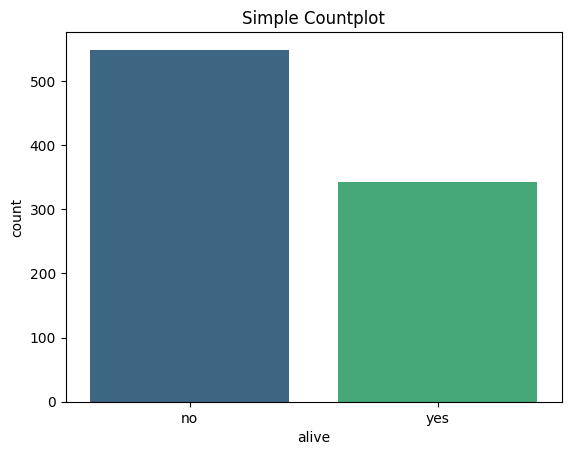

### *Relationship between different categorical variables*

```{Python echo=TRUE}
# Clustered Countplot
sns.countplot(data=titanic, y="who", hue="alive", palette='viridis')
plt.title('Clustered Countplot')
plt.show()
```

# 3. Histograms

Histograms visually depict the distribution of a dataset, offering insights into its key characteristics such as normality, skewness, or presence of multiple peaks.

They showcase the frequency or count of observations across various intervals or "bins" of the data.

Let's use iris dataset.

### *Visualize the shape, centre, range and spread of a continuous/numeric variable and to identify any patterns or outliers*

```{Python echo=TRUE}
# Histogram with KDE
sns.histplot(data=iris, x='sepal_width', kde=True)
plt.title('Histogram with KDE')
plt.show()
```

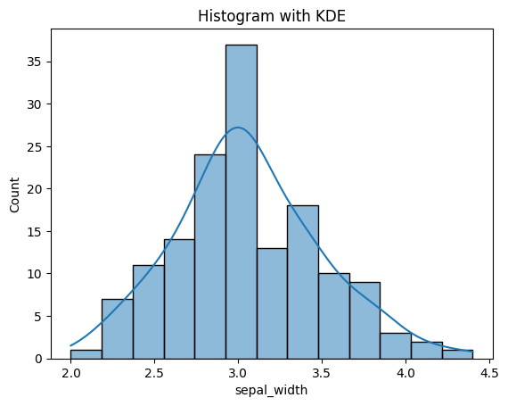

### *Compare the distribution of many continuous variables*

```{Python echo=TRUE}
# Histogram with multiple features
sns.histplot(data=iris[['sepal_length','sepal_width']])
plt.title('Multi-Column Histogram')
plt.show()
```

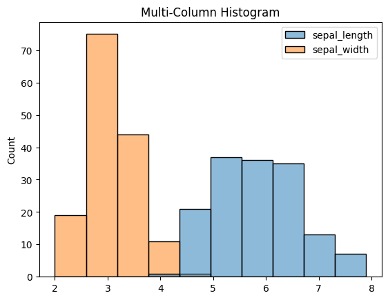

### *Compare the distribution of a continuous variable for different categories*

```{Python echo=TRUE}
sns.histplot(iris, x='sepal_length', hue='species', multiple='stack', linewidth=0.5)
plt.title('Stacked Histogram')
plt.show()
```

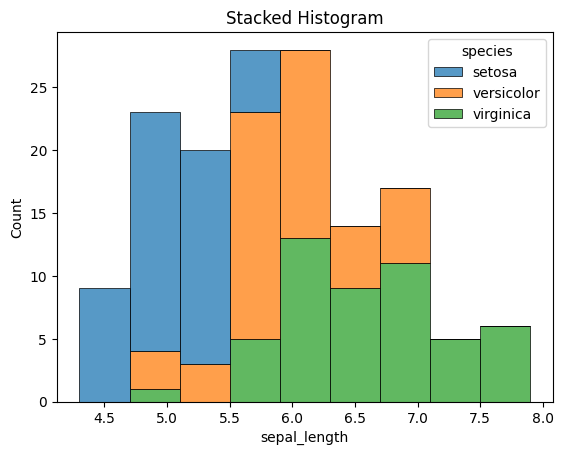

# 4. Cat Plots (Box, Violin, Swarm, Boxen)

Catplot is a flexible higher-level function that integrates various categorical seaborn plots including boxplots, violinplots, swarmplots, pointplots, barplots, and countplots.

Now, let's use tips dataset.

### *Boxplot*

```{Python echo=TRUE}
# Boxplot
sns.boxplot(data=tips, x='time', y='total_bill', hue='sex', palette='viridis')
plt.title('Boxplot')
plt.show()
```

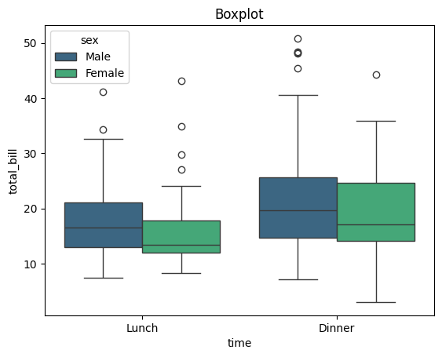

### *Violin plot*

```{Python echo=TRUE}
# Violinplot
sns.violinplot(data=tips, x='day', y='total_bill', palette='viridis')
plt.title('Violinplot')
plt.show()
```

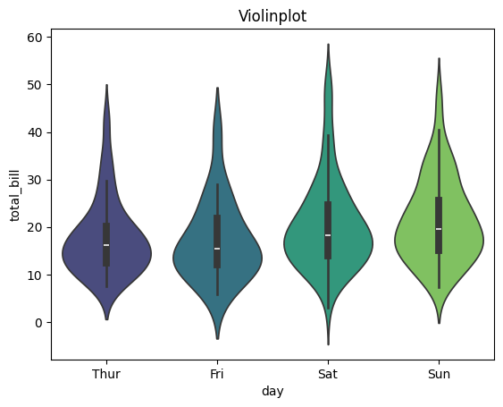

### *Swarm plot*

```{Python echo=TRUE}
sns.swarmplot(data=tips, x='time', y='tip', dodge=True, palette='viridis', hue='sex', s=6)
plt.title('SwarmPlot')
plt.show()
```

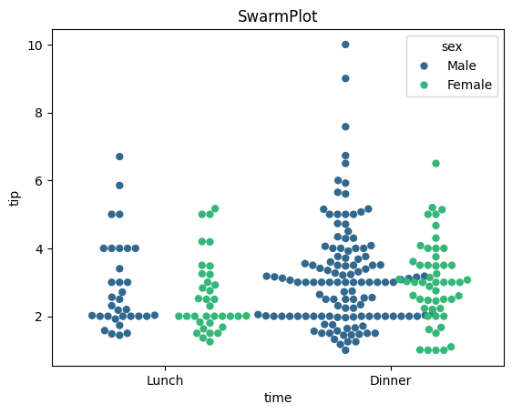

### *StripPlot*

```{Python echo=TRUE}
#StripPlot
sns.stripplot(data=tips, x='tip', hue='size', y='day', s=25, alpha=0.2, jitter=False, marker='D',palette='viridis')
plt.title('StripPlot')
plt.show()
```

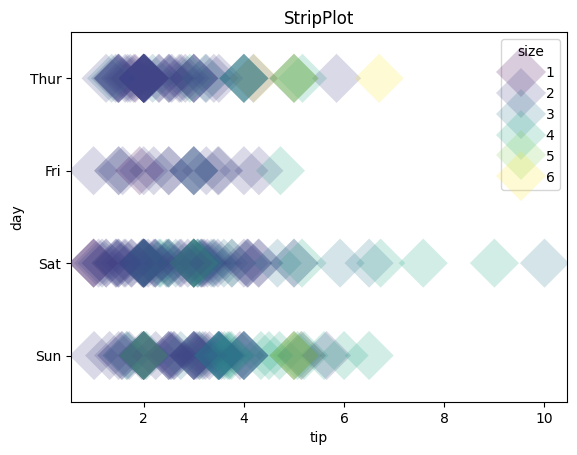

# 5. Multiple Plots using FacetGrid

FacetGrid, a component of the seaborn library, enables the creation of multiple data subsets arranged in a grid format. Each plot within the grid represents a specific category, determined by the column names specified in the 'col' and 'row' attributes of FacetGrid().

The plots within the grid can encompass various plot types supported by seaborn, including scatter plots, line plots, bar plots, and histograms.

For example, we utilized exercise dataset.

### *Boxplots for pulse rate during different activities*

```{Python echo=TRUE}
# Creating subplots using FacetGrid
g = sns.FacetGrid(exercise, col='kind', palette='Paired')

# Drawing a plot on every facet
g.map(sns.boxplot, 'pulse')
g.set_titles(col_template="Pulse rate for {col_name}")
```

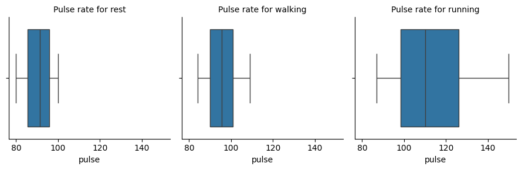

### *Scatter plots for flipper length and body mass of Penguins from different islands*

For this plot, we utilized penguins dataset.

```{Python echo=TRUE}
# Creating subplots using FacetGrid
g = sns.FacetGrid(penguins, col='island', hue='sex', palette='Paired')

# Drawing a plot on every facet
g.map(sns.scatterplot, 'flipper_length_mm', 'body_mass_g')
g.set_titles(template="Penguins of {col_name} Island")
g.add_legend()
```

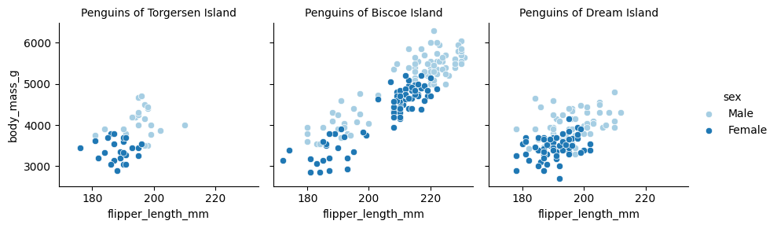

# 6. Joint Plots

A joint plot consolidates various univariate and bivariate plots within one figure. The focal point usually features a scatter plot or a hexbin plot, illustrating the joint distribution of the two variables.

Alongside, additional plots along the axes, such as histograms or Kernel Density Estimations (KDEs), depict the individual distributions of each variable.

Let's use mpg dataset to see some examples.

### *Comparison of the displacement and mpg for cars*

```{Python echo=TRUE}
# Hex Plot with Histogram margins
sns.jointplot(x="mpg", y="displacement", data=mpg, height=5, kind='hex', ratio=2, marginal_ticks=True)
```

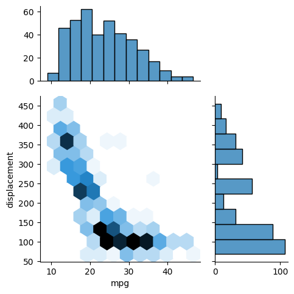

### *Comparison of acceleration and horsepower for cars from different countries*

```{Python echo=TRUE}
# Scatter Plot with KDE Margins
sns.jointplot(x="horsepower", y="acceleration", data=mpg, hue="origin", height=5, ratio=2, marginal_ticks=True)
```

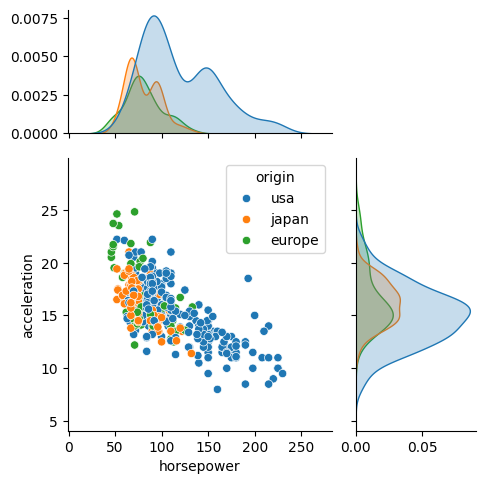

# 7. KDE Plots

A KDE (Kernel Density Estimate) plot is a smoothed rendition of a histogram, showcasing the probability density function of a continuous random variable.

The y-axis denotes the density or probability of observing a specific value of the variable, while the x-axis signifies the values of the variable itself.

### *Comparing the horsepower of cars with respect to number of cylinders*

```{Python echo=TRUE}
#Overlapping KDE Plots
sns.kdeplot(data=mpg, x='horsepower', hue='cylinders', fill=True,
           palette='viridis', alpha=.5, linewidth=0)
plt.title('Overlapping KDE Plot')
plt.show()
```

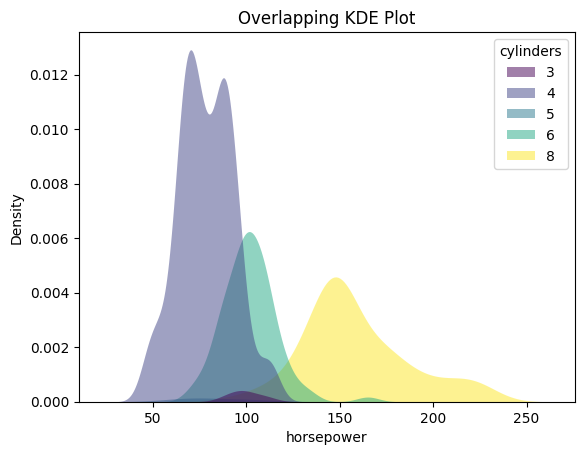

# 8. Pairplots

A pair plot is a visualization technique that enables exploration of relationships between multiple variables within a dataset. It comprises a grid of scatter plots, where each variable is plotted against every other variable.

Along the diagonal, histograms or density plots for each variable illustrate the distribution of values.

```{Python echo=TRUE}
#Simple Pairplot
sns.pairplot(data=penguins, corner=True)
```

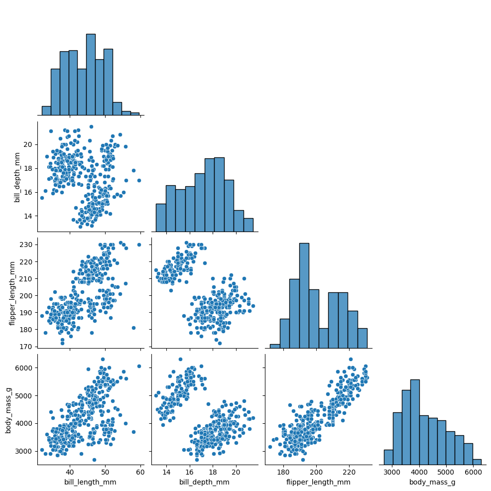

```{Python echo=TRUE}
# Pairplot with hues
sns.pairplot(data=penguins, hue='species')
```

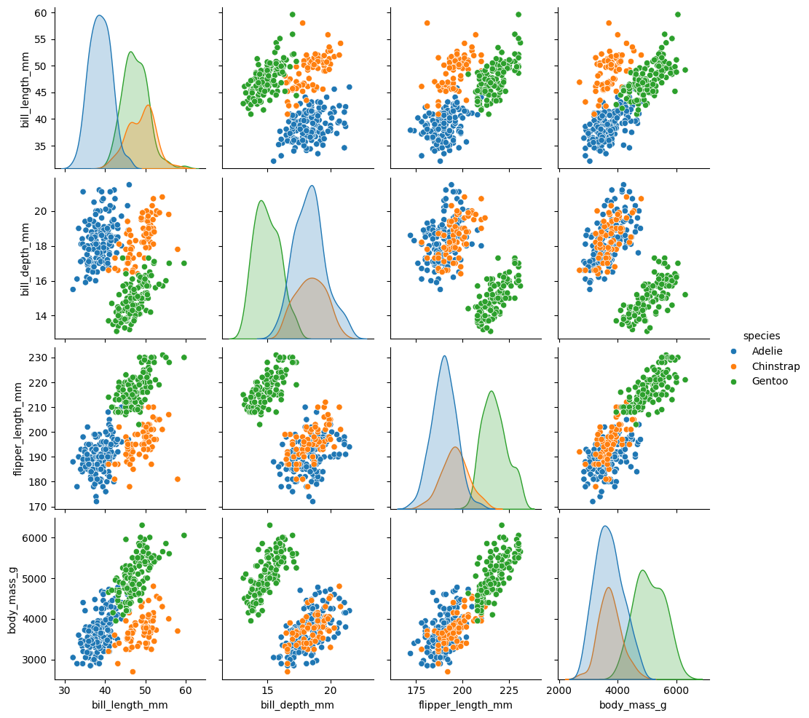

# 9. Heatmaps

Heatmaps serve as visual representations utilizing color-coded cells to exhibit the values within a matrix or data table.

Within a heatmap, the rows and columns of the matrix represent distinct variables, while the intensity of each cell's color depicts the magnitude or value of the data point at the intersection of those variables.

```{Python echo=TRUE}
#Selection of numeric columns from the dataset
num_cols = list(mpg.select_dtypes(include='number'))
fig = plt.figure(figsize=(12,7))

#Correlation Heatmap
sns.heatmap(data=mpg[num_cols].corr(),
            annot=True, cmap=sns.cubehelix_palette(as_cmap=True))
plt.title('Heatmap of Correlation matrix')
plt.show()
```

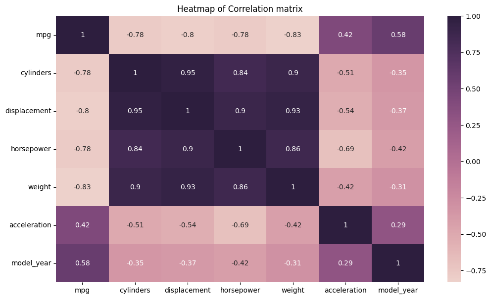

# 10. Scatter Plots

A scatterplot illustrates the correlation between two continuous variables by plotting individual data points on a graph, where one variable is depicted on the x-axis and the other on the y-axis.

The resulting plot displays multiple points scattered across the graph, hence earning the name "scatterplot."

Scatter plots serve several purposes in data analysis and visualization:

- Visualizing Relationships: They help in understanding the relationship between two continuous variables. For example, they can reveal if there's a positive, negative, or no correlation between the variables.

- Identifying Patterns: Scatter plots can help identify patterns or trends in data, such as clusters or outliers, which may not be apparent from summary statistics alone.

- Assessing Correlation: They allow for a quick assessment of the strength and direction of the relationship between variables. Strong correlations often result in a more structured or linear arrangement of points, while weak correlations may result in a more scattered arrangement.

- Checking for Linearity: Scatter plots are useful for assessing whether a linear model is appropriate for the data. If the points form a clear linear pattern, linear regression may be a suitable modeling technique.

- Visualizing Distribution: Scatter plots provide insights into the distribution of data points along both the x-axis and y-axis, which can help in understanding the overall shape of the data distribution.

```{Python echo=TRUE}
# Simple Scatterplot
sns.scatterplot(data=mpg, x='weight', y='horsepower', s=150, alpha=0.7)
plt.title('Simple Scatterplot')
plt.show()
```

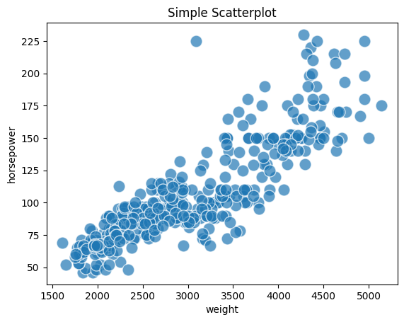

```{Python echo=TRUE}
# Scatterplot with Hue
sns.scatterplot(data=mpg, x='weight', y='horsepower', s=150, alpha=0.7,
               hue='origin', palette='viridis')
plt.title('Scatterplot with Hue')
plt.show()
```

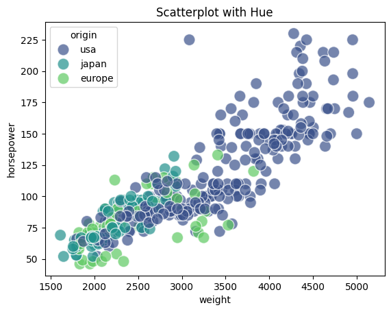

```{Python echo=TRUE}
# Scatterplot with Hue and Markers
sns.scatterplot(data=mpg, x='weight', y='horsepower', s=150, alpha=0.7,
              style='origin',palette='viridis', hue='origin')
plt.title('Scatterplot with Hue and Markers')
plt.show()
```

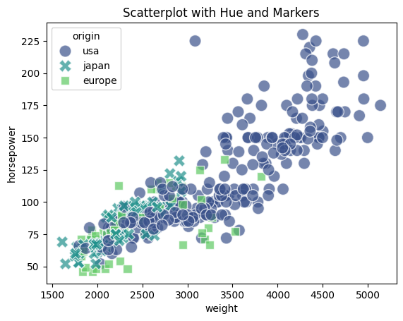

```{Python echo=TRUE}
# Scatterplot with Hue & Size
sns.scatterplot(data=mpg, x='weight', y='horsepower', sizes=(40, 400), alpha=.5,
              palette='viridis', hue='origin', size='cylinders')
plt.title('Scatterplot with Hue & Size')
plt.show()
```

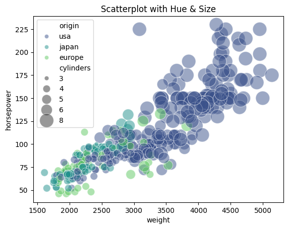

## More details can be seen in the links below:

1. [Bar Plots](https://seaborn.pydata.org/generated/seaborn.barplot.html)

2. [Count Plots](https://seaborn.pydata.org/generated/seaborn.countplot.html)

3. [Histograms](https://seaborn.pydata.org/generated/seaborn.histplot.html)

4. [Cat Plots (Box, Violin, Swarm, Boxen)](https://seaborn.pydata.org/generated/seaborn.catplot.html)

5. [Multiple Plots using FacetGrid](https://seaborn.pydata.org/generated/seaborn.FacetGrid.html)

6. [Joint Plots](https://seaborn.pydata.org/generated/seaborn.jointplot.html)

7. [KDE Plots](https://seaborn.pydata.org/generated/seaborn.kdeplot.html)

8. [Pairplots](https://seaborn.pydata.org/generated/seaborn.pairplot.html)

9. [Heatmaps](https://seaborn.pydata.org/generated/seaborn.heatmap.html)

10.[Scatter Plots](https://seaborn.pydata.org/generated/seaborn.scatterplot.html)

### References 
-[Ten Must-Know Seaborn Plots](https://medium.com/@snehabajaj108/ten-must-know-seaborn-plots-1f3a82dc99c5);

-[Seaborn: statistical data visualization](https://seaborn.pydata.org/index.html);


