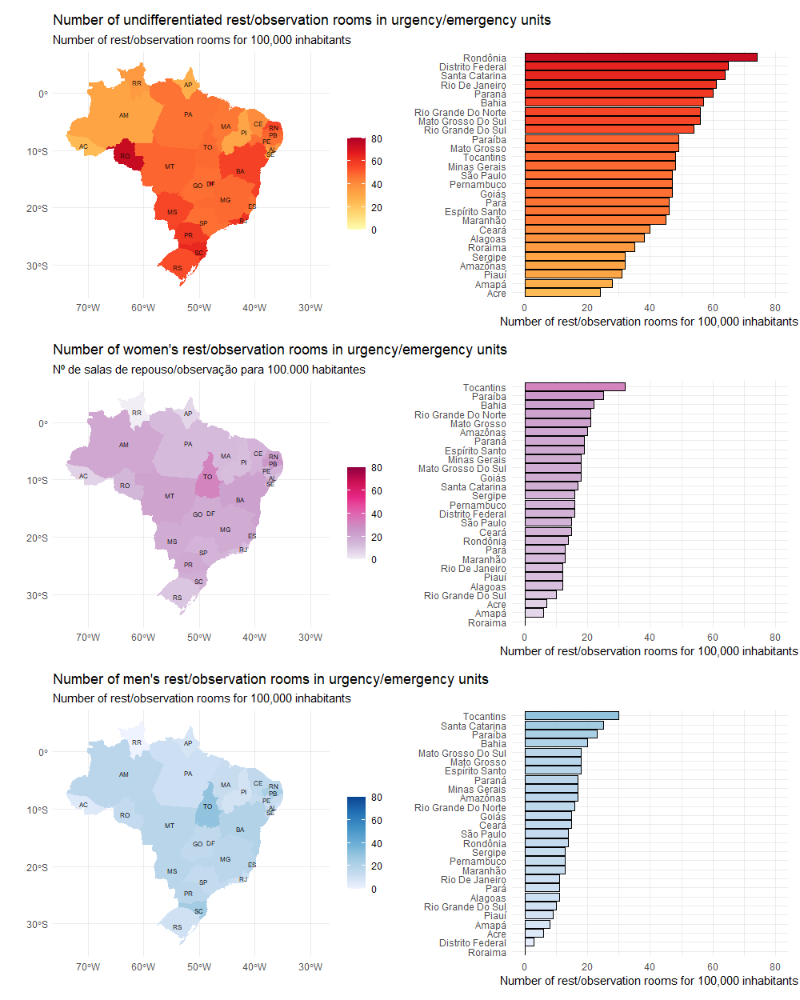
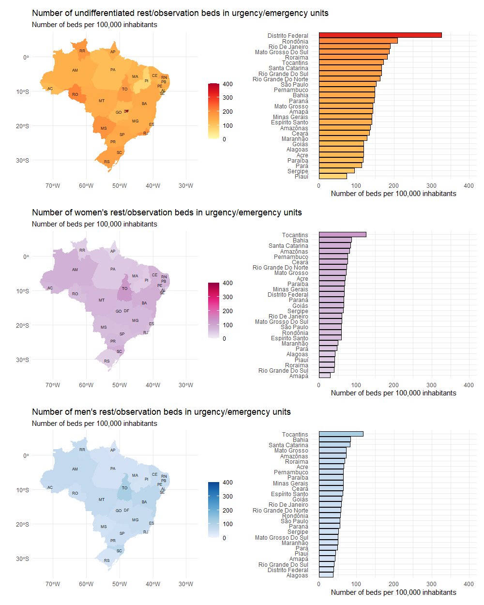

# Health Equity: Who Are Hospital Rooms And Beds For In Brazil?

<!-- badges: start -->
<!-- badges: end -->

Sustainable development refers to a global effort that involves development capable of meeting the needs of the current generation without compromising the ability to meet the needs of future generations. This concept is broad and aims at the environmental, economic, and social development of all societies. To achieve this, seventeen goals have been created in an attempt to guide sustainable development objectives. They are:

 - 1 - eradication of poverty;
 - 2 -  zero hunger and sustainable agriculture;
 - 3 - health and well-being;
 - 4 - quality education;
 - **5 - gender equality;**
 - 6 - clean water and sanitation;
 - 7 - affordable and clean energy;
 - 8 - decent work and economic growth;
 - 9 - industry, innovation, and infrastructure;
 - 10 - reduced inequalities;
 - 11 - sustainable cities and communities;
 - 12 - responsible consumption and production;
 - 13 - action against global climate change;
 - 14 - life below water;
 - 15 - life on land;
 - 16 - peace, justice, and strong institutions and;
 - 17 - partnerships and means of implementation.

In particular, gender equality refers to ensuring that all individuals have the same opportunities, rights, and fair treatment, regardless of their gender (3). Similarly, health equity refers to the provision of equal service regardless of gender (4). Although its role is crucial for universal healthcare, gender equity in health remains a significant challenge for nations, including Brazil. It must be carefully monitored so that we can achieve the desired goal of universal coverage.

In this scenario, the healthcare systems must provide equal assistance regardless of gender. Therefore,  

Therefore, this analysis had as its main purpose to describe the number of consultation rooms, examination rooms, and resting/observation beds in emergency care services for women, men, and undifferentiated individuals in the Brazilian public healthcare system.

## How to do it?

The number of undifferentiated rooms, rest/observation rooms and the number of observation rest beds in emergency/urgency units and exclusively for men and women were obtained through the National Registry of Health Establishments (Cadastro Nacional de Estabelecimentos de Saúde - CNES).

Briefly, CNES is an official information system for registering data from all healthcare establishments in Brazil, regardless of their legal nature or integration with the Unified Health System (SUS). It is the Ministry of Health's official registry concerning the reality of installed capacity and healthcare workforce in Brazil within public or private healthcare establishments, whether affiliated with SUS or not.

To acquire estimates of the total population of the Brazilian Federation Units, the Brazilian population database from the Brazilian Institute of Geography and Statistics (IBGE) was used. The number of beds per state was relativized by the size of the study population and is expressed as the number of rooms or beds per 100,000 habitants ([n/population]*100,000).


## SO, LET'S TO DO IT

## Libraries required
```{r message=FALSE, warning=FALSE}
# libraries
library(basedosdados)
library(geobr)
library(dplyr)
library(ggplot2)
library(patchwork)
```


```{r message=FALSE, warning=FALSE}
# Acess project in the BD ---------------------------------------------------------------------
basedosdados::set_billing_id("analise-dados-curso-bda")

# Query - CNES and Population -------------------------------------------------------------------
query <-
"
SELECT
  a.ano,
  a.sigla_uf,
  b.populacao,
  SUM(quantidade_leito_repouso_feminino_urgencia) AS total_leito_repouso_fem_urgencia,
  SUM(quantidade_leito_repouso_masculino_urgencia) AS total_leito_repouso_masc_urgencia,
  SUM(quantidade_leito_repouso_indiferenciado_urgencia) AS total_leito_repouso_ind_urgencia,
  SUM(quantidade_consultorio_feminino_urgencia) AS total_consultorio_fem_urgencia,
  SUM(quantidade_consultorio_masculino_urgencia) AS total_consultorio_masc_urgencia,
  SUM(quantidade_consultorio_indiferenciado_urgencia) AS total_consultorio_ind_urgencia,
  SUM(quantidade_sala_repouso_feminino_urgencia) AS total_sala_repouso_fem_urgencia,
  SUM(quantidade_sala_repouso_masculino_urgencia) AS total_sala_repouso_masc_urgencia,
  SUM(quantidade_sala_repouso_indiferenciado_urgencia) AS total_sala_repouso_ind_urgencia,
  SUM(quantidade_sala_repouso_feminino_ambulatorial) AS total_sala_repouso_fem_ambulatorio,
  SUM(quantidade_sala_repouso_masculino_ambulatorial) AS total_sala_repouso_masc_ambulatorio,
  SUM(quantidade_sala_repouso_indiferenciado_ambulatorial) AS total_sala_repouso_ind_ambulatorio
FROM
  basedosdados.br_ms_cnes.estabelecimento a
INNER JOIN
    basedosdados.br_ibge_populacao.uf b
  ON
    a.sigla_uf = b.sigla_uf
WHERE
  a.ano = 2021 AND b.ano = 2021
GROUP BY
  ano,
  a.sigla_uf,
  b.populacao
"

# reading the Query -------------------------------------------------------------------------------
df <-
  basedosdados::read_sql(query)

# Look the query -------------------------------------------------------------------------
dplyr::glimpse(df)
```

#### YESSSS...Now we have a dataset!!!

Let's save the dataset.

```{r}
readr::write_rds(x = df, file = "tabela")
```


## LET'S MAKE PLOTS

## Number of service rooms/offices in urgency/emergency units


## Number of rest/observation rooms in urgent/emergency units



## Number of rest/observation beds in urgent/emergency units



## WHAT DO FIGURES SHOW US?

In general, Brazil has 1.916, 2.091, and 7.451 rooms/offices, rest/observation rooms, and the number of rest/observation beds in emergency/urgency units per 100,000 inhabitants, respectively. 

Brazil presents 204 and 175 rooms/offices in emergency/urgency units exclusively for men and women per 100,000 inhabitants.

Regarding rest rooms in emergency/urgency units, there are 385 and 427 units per 100,000 inhabitants exclusively for men and women.


Finally, the number of rest/observation beds in emergency/urgency units exclusively for men and women is 1,636 and 1,738 per 100,000 inhabitants, respectively.

In summary, these data indicate gender equity in the distribution of rooms/offices, rest/observation rooms and beds in emergency/urgency units, indicating Brazilian efforts toward Global Sustainable Development.


### References 
-[Gender norms and health: insights from global survey data](https://pubmed.ncbi.nlm.nih.gov/31155273/);

-[Transforming our World: The 2030 Agenda for Sustainable Development](https://sdgs.un.org/publications/transforming-our-world-2030-agenda-sustainable-development-17981);

-[Gender equality and gender norms: framing the opportunities for health](https://pubmed.ncbi.nlm.nih.gov/31155276/)

-[Gender Equality in Health](https://www.paho.org/en/topics/gender-equality-health)


