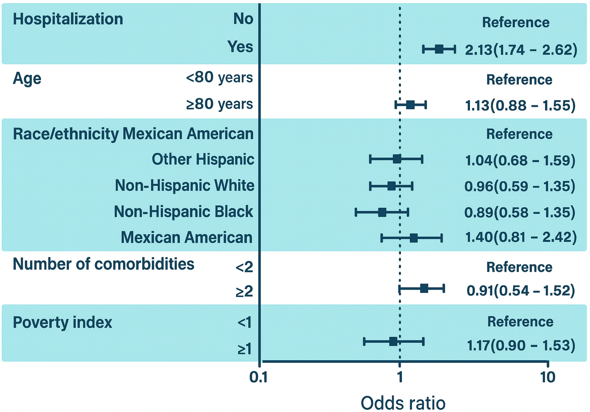
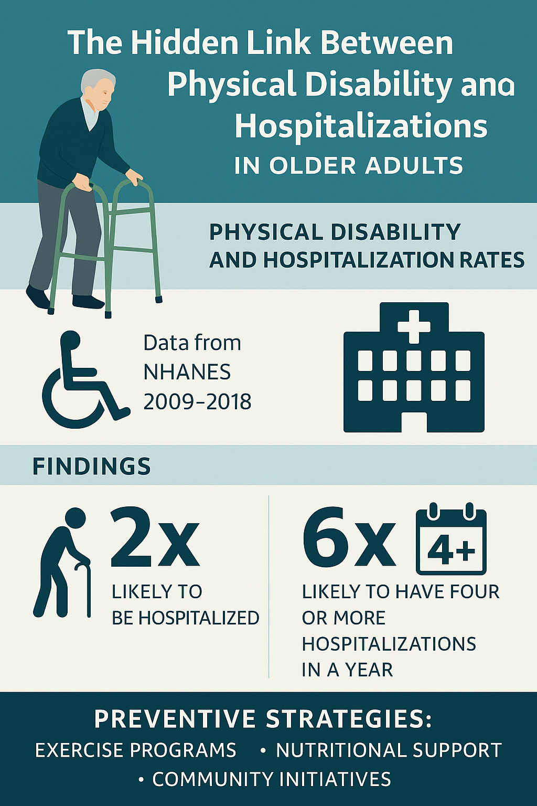

# The Hidden Link Between Physical Disability and Hospitalizations in Older Adults

<!-- badges: start -->
<!-- badges: end -->

## Increase in the Older Adult Population👴

Global population aging is accelerating, bringing significant challenges for public health. 

Current estimates predict that by 2030, one in every six people worldwide will be 60 years or older, and by 2050, this group will exceed 2 billion individuals. 

This demographic shift poses unprecedented economic, cultural, medical, social, and policy challenges, as older adults are more susceptible to multiple comorbidities, chronic diseases, and functional limitations

## Research Findings🔍🧑‍🔬

As our global population ages, understanding the factors that influence health and well-being becomes increasingly important. 

A recent study analyzing data from over 4,300 adults aged 65 and older revealed a striking connection between physical disability and hospitalization rates.

The research, based on data from the U.S. National Health and Nutrition Examination Survey (NHANES) from 2009 to 2018, found that older adults with any level of physical disability were twice as likely to be hospitalized compared to those without disabilities. 

Even more concerning, individuals with disabilities had almost six times the odds of being hospitalized four or more times in a single year.

### LOOK THE RESULTS!🤓
### *Associations Between Disability with Hospitalization*

### *Associations Between Disability with Frequency of Hospitalization*

These findings highlight how vital it is to maintain physical function in later life. Simple daily activities like walking across a room, standing from a chair, eating, and dressing are more than just routines—they are key indicators of overall health.

When these functions decline, the risk of hospital admissions and repeated readmissions rises significantly.

## Practical Applications⚠️

For public health, this study underscores the urgent need for preventive strategies, including exercise programs, nutritional support, and community initiatives aimed at keeping older adults active and independent.

By addressing physical 🤸‍♂️️disability early🤸‍♀️, we can not only improve quality of life but also reduce the strain on healthcare systems.

Aging is inevitable, but losing independence doesn’t have to be. 

Small, proactive steps today can lead to healthier, more independent tomorrows for our older population😉.

## References 

### Scientific paper

- [ Physical disability is associated with increased odds for hospitalization in older adults: analysis from NHANES 2009–2018](https://doi.org/10.1016/j.bjpt.2025.101254);

### News (in portuguese)

- [Idosos com incapacidade física têm mais chance de hospitalização, aponta estudo](https://noticias.r7.com/prisma/ciencia-para-o-dia-a-dia/incapacidade-fisica-aumenta-a-chance-de-hospitalizacao-em-idosos-aponta-estudo-15082025/);

